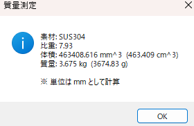
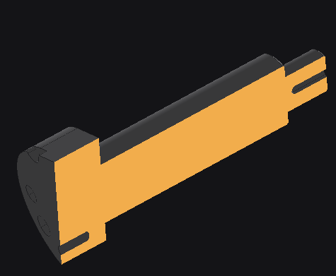
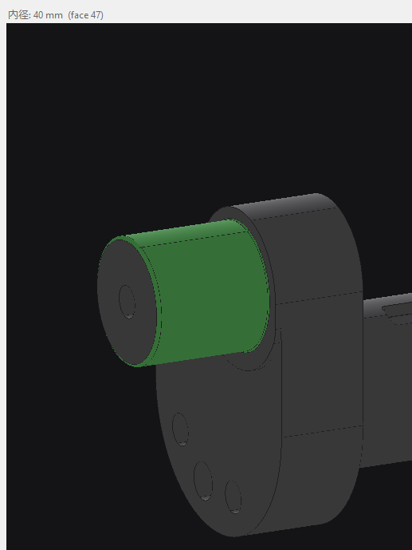
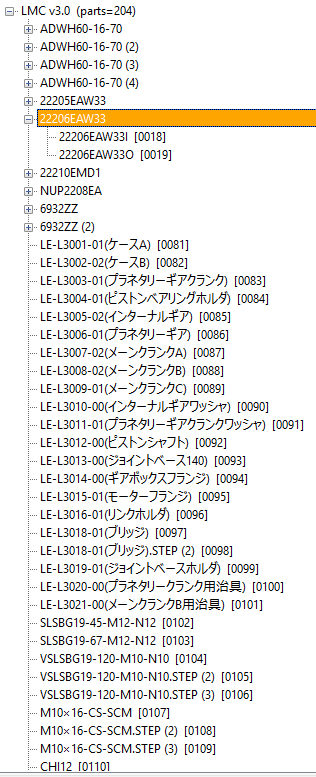

# StepGeomChecker

  <b>3D model viewing, measurement, and reporting in one practical Windows tool.</b> 
  <b>3Dデータの閲覧・計測・記録を、ひとつのツールで扱いやすく。</b>

  StepGeomChecker is a free Windows desktop tool for viewing and inspecting STEP / IGES / STL models. 
  STEP / IGES / STL の表示、断面確認、計測、重量設定、HTMLレポート出力までを扱えるフリーソフトです。

  
  
  

---

## English

**StepGeomChecker** is a free Windows utility for viewing and inspecting 3D CAD files such as **STEP**, **IGES**, and **STL**.

It is designed for practical daily use: open models quickly, check sections, browse assembly trees, measure geometry, set weight information, and export results as **HTML reports**.

### Highlights

- View **STEP / IGES / STL** models in a Windows GUI
- Switch between **perspective** and **orthographic** view
- Use preset views such as **front / right / top / isometric**
- Toggle **wireframe / shaded** display and control transparency
- Use **section view** for internal confirmation
- Browse **assembly trees** with linked highlight display
- Isolate a selected part or subassembly
- Measure:
  - shortest distance between faces
  - cylinder diameter
  - corner radius
  - perimeter and area
  - edge length
  - center-to-center distance
- Use **Shift + click** for edge-priority selection
- Preview edges on hover during measurement
- Manage measurement result lists with memo editing and highlight recall
- Auto-save and restore measurement sessions as **JSON**
- Export measurement and weight information as **HTML reports**
- Set weights for parts and subassemblies
- Use material presets for automatic weight calculation
- Export selected parts, subassemblies, or full models to **STEP / IGES / STL**

### Typical Use Cases

- Checking 3D model shapes before sharing or review
- Inspecting internal geometry with section view
- Measuring distances, diameters, radii, perimeter, or area
- Recording inspection results as HTML reports
- Managing part or subassembly weight information
- Exporting selected geometry for reuse

---

## 日本語

**StepGeomChecker** は、**STEP**、**IGES**、**STL** などの 3D CAD データを表示・確認・計測できる Windows 向けフリーソフトです。

モデルの表示、断面確認、アセンブリツリー確認、各種計測、重量設定、**HTML レポート出力** までを、実務で使いやすい形でまとめています。

### 特長

- **STEP / IGES / STL** を Windows GUI で表示可能
- **透視投影 / 平行投影** を切替可能
- **正面 / 右 / 上 / アイソメ** などの視点へ切替可能
- **ワイヤー / シェーディング** 表示切替と透明度調整に対応
- **断面表示** により内部形状を確認可能
- **アセンブリツリー** と連動したハイライト表示に対応
- 選択部品やサブアセンブリの **単独表示** に対応
- 以下の計測に対応
  - 面間の最短距離
  - 円筒径
  - コーナーR
  - 外周・面積
  - エッジ長さ
  - 中心間距離
- **Shift + クリック** によるエッジ優先選択に対応
- 計測時のエッジホバープレビューに対応
- 計測結果一覧のメモ編集、削除、再ハイライトに対応
- 計測セッションを **JSON** で自動保存・復元可能
- 計測結果や重量情報を **HTML レポート** として出力可能
- 部品・サブアセンブリごとの重量設定に対応
- 材料プリセットによる重量自動計算に対応
- 選択部品、サブアセンブリ、全体モデルを **STEP / IGES / STL** へ出力可能

### 主な用途

- 3Dモデル形状をすばやく確認したいとき
- 断面で内部形状を確認したいとき
- 距離、径、R、外周、面積などを計測したいとき
- 計測結果を HTML レポートとして残したいとき
- 部品やサブアセンブリの重量を整理したいとき
- 必要部分だけを書き出して再利用したいとき

---

## Quick Links / クイックリンク

- **Download / ダウンロード**  
  [Go to Releases](../../releases)

- **Official Website / 公式ページ**  
  [LWJ - StepGeomChecker](http://www.lwj.co.jp/software/stepgeomchecker.html)

- **License / ライセンス**  
  See the [License section](#license--ライセンス) below.

---

## Screenshots / スクリーンショット

<table>
  <tr>
    <td align="center"><b>Main View / メイン画面</b></td>
    <td align="center"><b>Section View / 断面表示</b></td>
  </tr>
  <tr>
    <td></td>
    <td></td>
  </tr>

  <tr>
    <td align="center"><b>Measurement / 計測</b></td>
    <td align="center"><b>Assembly Tree / アセンブリツリー</b></td>
  </tr>
  <tr>
    <td></td>
    <td></td>
  </tr>
</table>

---

## Features / 機能一覧

| Feature | English | 日本語 |
|---|---|---|
| 3D viewing | Open and inspect STEP / IGES / STL models | STEP / IGES / STL を表示・確認 |
| View control | Switch projection, view direction, shading, and transparency | 投影方式、視点、表示方式、透明度を切替 |
| Section view | Inspect internal shape with section display | 断面表示で内部形状を確認 |
| Assembly tree | Browse parts and subassemblies with linked highlight | ツリーから部品・サブアセンブリを確認しハイライト連動 |
| Isolation | Isolate selected parts or subassemblies | 選択部品・サブアセンブリを単独表示 |
| Measurement | Measure distance, diameter, radius, perimeter, area, and edge length | 距離、径、R、外周、面積、エッジ長さを計測 |
| Session save | Auto-save and restore measurements with JSON | 計測内容を JSON で自動保存・復元 |
| HTML report | Export measurement and weight results to HTML | 計測結果・重量情報を HTML 出力 |
| Weight setup | Set weights for parts and subassemblies | 部品・サブアセンブリ重量を設定 |
| Export | Export full model or selected geometry to STEP / IGES / STL | 全体または選択形状を STEP / IGES / STL へ出力 |

---

## Supported Formats / 対応形式

### Input / 入力
- STEP (.step / .stp)
- IGES (.igs / .iges)
- STL (.stl)

### Output / 出力
- STEP
- IGES
- STL
- CSV
- HTML

---

## Download / ダウンロード

Please download the latest version from the **Releases** page.  
最新版は **Releases** ページからダウンロードしてください。

**[Download from Releases / Releases からダウンロード](../../releases)**

---

## Website / 公式ページ

The product page is also available on the company website.  
製品ページは当社ウェブサイトにも掲載しています。

**[LWJ - StepGeomChecker](http://www.lwj.co.jp/software/stepgeomchecker.html)**

---

## Notes / 注意事項

- Supported environment is **Windows 10 / 11 64-bit**.  
  対応環境は **Windows 10 / 11 64-bit** です。

- Some operations may take time depending on model size and complexity.  
  モデルサイズや複雑さによっては処理に時間がかかる場合があります。

- Please review exported results and measurements according to your workflow.  
  出力結果や計測結果は用途に応じて確認して使用してください。

---

## Environment / 対応環境

- Windows 10 / 11 64-bit

---

## License / ライセンス

This project is distributed as **free software**.  
本ソフトは **フリーソフト** として公開しています。

If you include a license file in this repository, please refer to it for detailed terms.  
詳細条件を記載したライセンスファイルを同梱する場合は、そちらを参照してください。

---

## Feedback / フィードバック

Bug reports, feedback, and suggestions are welcome.  
不具合報告、ご意見、ご要望を歓迎します。
